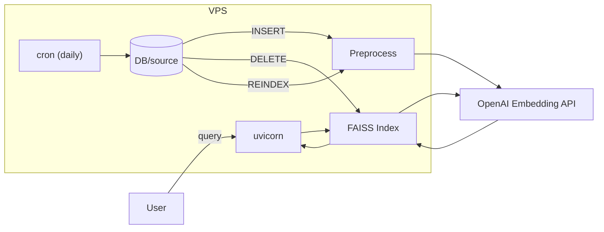
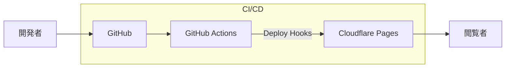
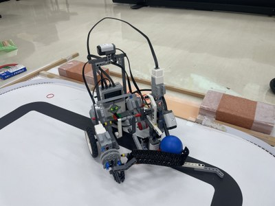

# Profile

## 名前

## 所属
京都大学工学部電気電子工学科 B3

## TL;DR
業務委託で会社向け業務改善システムを複数開発・運用しつつ、電気電子工学科でハード方面にも手を伸ばしている京大B3。Pythonをメインに最新技術をキャッチアップしながら、実務経験を積んでいる。面白重視の性格から、このAI過渡期に主体性を持って様々なことに取り組んでいる。

## 略歴
|年度|内容|
|:---:|:---|
| 2021/07 | 高校在学中にQA4Uに参加、オープンバッジを受領 |
| 2024/04 | 京都大学工学部電気電子工学科 入学 |
| 2024/06 | 個人事業主として開業 |
| 2024/06 | 株式会社晃商（現 晃商ホールディングス）と業務委託契約を締結、以降システムを用いた業務改善を中心に請け負う |
| 2024/09 | KUEE Electronics Summer Camp 2024 for 1回生で優勝 |
| | 以降、学業と実務に励む |

## 受賞歴
- [Quantum Annealing for You（量子アニ―リング実践的研究開発者育成講座）OpenBadge受領](https://www.openbadge-global.com/ns/portal/openbadge/public/assertions/detail/M1AwUkFOcVdacG5OZThBWE9wT21IUT09)
- [KUEE Electronics Summer Camp 2024 for 1回生 優勝](https://www.s-ee.t.kyoto-u.ac.jp/ja/summercamp/a65syu/kuee1st2024-summer/index)

## 人物
LLMの驚異的な進化を目の当たりにしてソフトだけではなくハード方面にも強い電気電子にいてよかったなと心から思っている。

良いところは明るく面白く主体性があるところ。ほぼ小2の学級目標。

悪いところは心配性で慎重すぎるところ。その点で言うとビジネスは向いていないがエンジニアには向いていると思う。

## 興味
ソフト面で言えば昔からゲームのバグや脆弱性、没データを取り扱う動画ばかりを見てきており、実務でも怒りながらではあるがデバッグとその挙動の調査を好む。はやくClaude MythosがYouTuberで「某有名ソフトに潜む脆弱性解説」とかやってくれたらなと思う。加速するAI関連技術にも興味があり、キャッチアップしている。最近だとQwenのようなローカルLLMが実用レベルになりつつあることに感動している。

ハード面ではマイコンやグラフィックボードのようなデバイスレベルの話に興味がある。いわゆる素子や電気機械のレイヤにはあまり惹かれない。ハードとソフトの境界領域こそ電電の出る幕だと思っており、就職もそういう方面が良いなと思っている。

## スキル
### プログラミング
| 言語 | 使用フレームワーク | 使用ライブラリ | 使用ツール |
|:-:|:-:|:-:|:-:|
| Python | FastAPI | mkdocs, zensical | uv, ruff, ty, pytest, Playwright |
| TypeScript | Node.js, Express | - | Vitest, Puppeteer |
| HTML, CSS, JavaScript, GAS, PHP | Bootstrap, Tailwind CSS | htmx, NetCommons3 | - |

### インフラ
|区分|サービス|
|:-:|:-:|
| インフラ | AWS EC2, VPS |
| Webサーバ | nginx, Apache |
| DB | MySQL |
| CI/CD, 自動化 | GitHub Actions, Shell Script, systemd, cron |
| 配信 | Cloudflare Pages |
   

## 制作物（業務、NDAにより概要のみ）
### 2024/12 勤怠管理・請求書自動発行システム（GAS）
GASにより、バリデーション付きのフォーム配信、スプレッドシートへの記録、請求書一括発行を実現。初めて制作したシステムであったが、2026年5月現在に至るまで安定的に稼働を続けている。途中で任意月の勤務実績を確認できるAPIを実装したり時給改定を可能にしたりとアップデートを重ねている。

### 2025/10 社内文書ベクトル検索システム（Python, text-embedding-3）
PythonのFAISS+OpenAI text-embedding-3を用いて構築。既存のポータルの基盤システムに同居する形にするのに大変苦労した。また、VPSの特殊な環境（管理者権限なし、1プロセス4GB以上のメモリ使用でフリーズ等）にも苦しめられた。こちらも完成後は2026年5月現在に至るまで安定的に稼働を続けている。週次でいうと30件ほど利用されているようだ。

### 2025/10 EC売上の自動取得・集計スクリプト（Puppeteer, TypeScript）
APIが提供されていないECサイトから売上データを自動取得し、スプレッドシートに集計するスクリプト。
### 2026/05 研修資料配信基盤の構築（MkDocs, Cloudflare Pages）
MkDocs Material+GitHub Actions+Cloudflare Pagesによる研修資料配信基盤。当ポートフォリオサイトも後継のZensicalを用いた同様のスタックによって構築されている。

### （開発中） LLMを用いた問い合わせ対応・自動起票システム（Python, FastAPI）
OpenAI Responses starter appをベースにFastAPIとHTMXを用いて構築中。問い合わせ一次対応と業務チケット起票作業の自動化を目指している。
## 制作物（その他）
### 2024/09 KUEE Electronics Summer Camp 2024 for 1回生 「Romantic Launcher」
LEGO Mindstormを用いて制作されたロボット。競技「マクスウェルの悪魔」は青玉を自分陣地（できればゴール）へ、赤玉を相手陣地に押し付けるゲームであり、限られたセンサとパーツでライントレースと玉の移動を実現する必要がある。本機はライントレースしながら収集した玉の色を判別し、対応するゴールに向けてカタパルトで発射するというロマンあるコンセプトで制作した。結果はTAチームとのエキシビション以外は全勝であった。

### 2025/07 2回前期・電気電子回路演習 「硬貨判別回路」
30秒のPR映像制作（YMM4）とプログラム制作（Python,bat）を担当。電気回路を用いて6種類の硬貨を判別するのが目的。素材上1つの判定だけでは同定できなかったため、3つの判定を組み合わせることで6種類の硬貨を判別可能にした。

1. 渦電流による並列共振回路のゲイン低下度合いを判別（Pythonでゲインを解析）
2. 穴の有無を判別（光を照射して透過光をフォトトランジスタで検出）
3. 光の反射を判別（青色光の反射光をフォトトランジスタで検出）

<video controls width="100%">
    <source src="./assets/coincheck_pr.mp4" type="video/mp4">
    Your browser does not support the video tag.
</video>